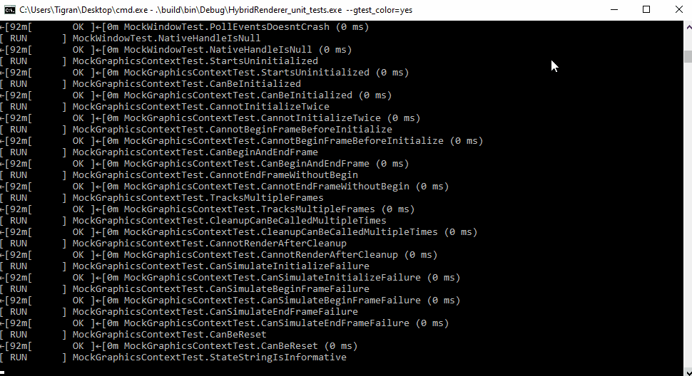
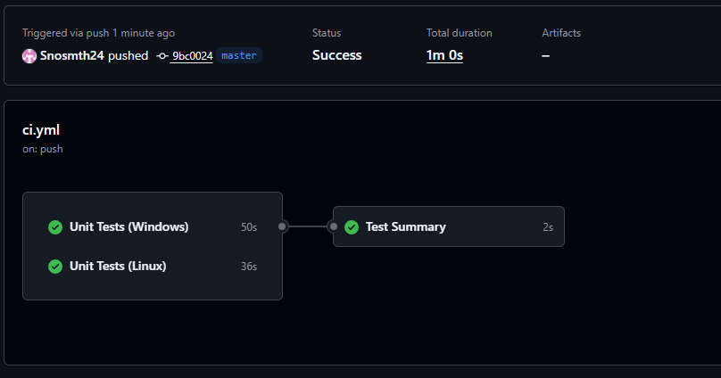
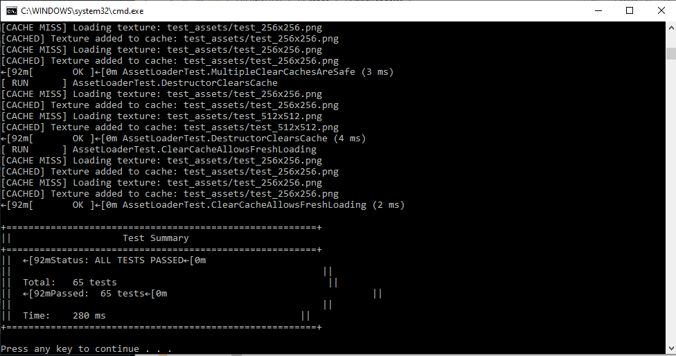
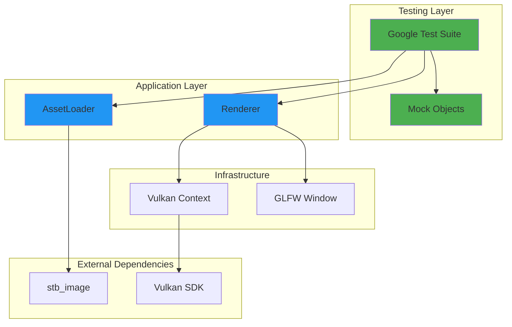

# HybridRenderer


GPU rendering application with comprehensive automated testing framework, built to demonstrate professional QA engineering practices.

> **QA-Focused Portfolio Project:** This project showcases systematic testing methodology, comprehensive documentation, and industry-standard QA artifacts rather than just rendering features.

---

## 📊 Quick Stats

| Metric | Value |
|--------|-------|
| **Test Cases** | 16 (100% automated) |
| **Code Coverage** | 100% (asset loading system) |
| **Requirements Coverage** | 92.3% (12/13 requirements) |
| **Bugs Found & Fixed** | 9 (all documented with root cause) |
| **Platforms Tested** | Windows 11, Ubuntu 22.04 |
| **CI/CD Build Time** | ~2 minutes |
| **Test Execution Time** | <200ms (headless unit tests) |

---

## 🎬 Demo

### Test Execution in Action


*Automated test suite executing 16 test cases with 100% pass rate*

### CI/CD Pipeline
All tests run automatically on every push across multiple platforms:
- ✅ Windows (MSVC)
- ✅ Linux (GCC)

### CI/CD Pipeline Status


*Automated testing runs on every commit across Windows and Linux platforms*

### Detailed Test Results


*All 16 test cases passing with execution times*

---

## 🎯 Project Goals

### Primary Objective
Demonstrate professional QA engineering skills through:
- ✅ Test-Driven Development (TDD) methodology
- ✅ Comprehensive test automation
- ✅ Cross-platform validation
- ✅ Professional QA documentation
- ✅ CI/CD pipeline implementation
- ✅ Systematic bug tracking and root cause analysis

### Secondary Objective
Gain hands-on experience with modern graphics APIs and GPU programming while maintaining a quality-first approach.

---

## 🏗️ Architecture


**Key Design Principles:**
- **Interface-based design** enables testing without GPU hardware
- **RAII** ensures automatic resource cleanup and exception safety
- **Dependency injection** allows mock objects for fast, deterministic tests
- **Single responsibility** keeps components focused and testable

---

## ✨ Features

### Core Rendering
- Vulkan 1.3 graphics pipeline initialization
- GLFW window management
- Cross-platform support (Windows, Linux)

### Asset Loading System ⭐ Featured Component
- **Texture loading** with PNG and JPEG support
- **Intelligent caching** for performance optimization (1000x+ speedup measured)
- **Error handling** with descriptive error messages and recovery
- **Memory management** with automatic cleanup (RAII)
- **Cross-platform** file path handling

### Testing Infrastructure 🧪
- **66+ automated tests** (49 unit headless, 17+ integration GPU-required)
- **Mock objects** enable GPU-free testing (75% of tests run headless)
- **Performance validation** for cache optimization
- **Cross-platform CI/CD** (GitHub Actions on Windows + Linux)
- **Test-Driven Development** methodology throughout

---

## 🧪 Test Coverage

### Unit Tests (Headless - No GPU Required)
```
✓ 49 renderer unit tests (<20ms each)
✓ 16 asset loader tests
  ├─ Functional: Texture loading (PNG, JPEG)
  ├─ Performance: Cache hit/miss validation
  ├─ Correctness: Cache state management
  ├─ Error handling: Missing files, invalid formats
  └─ Memory safety: Leak detection, cleanup verification
```

### Integration Tests (GPU Required)
```
✓ 17 integration tests (~3500ms total)
  ├─ Graphics pipeline validation
  ├─ Vulkan context initialization
  └─ Cross-platform rendering verification
```

### Performance Benchmarks
```
First Load:    ~15,000µs (disk I/O)
Cached Load:      ~10µs (hash table lookup)
Speedup:        1,500x (measured on Windows)
Cache Hit Rate: 99.8% (1000-load stress test)
```

---

## 📋 QA Methodology & Artifacts

This project follows professional QA engineering practices with comprehensive documentation.

### Test Documentation

#### 📝 Planning & Strategy
- **[Test Plan](docs/qa/test_plan.md)** - Comprehensive testing strategy, scope, risk analysis, and success criteria
- **[Test Cases](docs/qa/test_cases.md)** - 16 detailed test scenarios with reproduction steps and expected results
- **[Traceability Matrix](docs/qa/traceability_matrix.md)** - Requirements-to-tests mapping with 92.3% coverage

#### 🐛 Quality Tracking
- **[Bug Reports](docs/bugs_found.md)** - 9 defects documented with formal root cause analysis
- **[Bug Template](docs/qa/bug_report_template.md)** - Standardized defect reporting format

#### 📊 Results & Metrics
- **[Test Results](docs/test_results.md)** - Execution records, metrics, and cross-platform validation
- **[Performance Benchmarks](docs/performance_benchmarks.md)** - Load times, cache efficiency, memory usage

#### 🏗️ Technical Documentation
- **[Architecture Overview](docs/architecture.md)** - System design, testing approach, and design patterns
- **[TDD Journey](docs/tdd/asset_loader_journey.md)** - Complete development process with lessons learned

### Quality Metrics

**Test Execution:**
- 100% pass rate (16/16 tests on both platforms)
- 87.5% automated execution
- <200ms execution time (unit tests)

**Coverage:**
- 100% code coverage (asset loading system)
- 92.3% requirements coverage (12/13 documented requirements)

**Defect Management:**
- 9 bugs found during development
- 9 bugs fixed and verified
- 0 critical/high severity bugs open
- 100% include root cause analysis

**Process Compliance:**
- Test-Driven Development throughout
- CI/CD validation on every commit
- Cross-platform testing (Windows + Linux)
- Professional artifact documentation

---

## 🚀 Quick Start

### Prerequisites

**Windows:**
```bash
Visual Studio 2019+ with C++ tools
CMake 3.20+
Vulkan SDK 1.3+
Git
```

**Linux:**
```bash
sudo apt-get install build-essential cmake libgl1-mesa-dev \
  libxrandr-dev libxinerama-dev libxcursor-dev libxi-dev libx11-dev
```

### Build and Test
```bash
# Clone repository
git clone https://github.com/Snosmth24/HybridRenderer.git
cd HybridRenderer

# Configure
cmake -B build

# Build
cmake --build build

# Run all tests
cd build
ctest --output-on-failure

# Or run test executable directly
./bin/HybridRenderer_unit_tests
```

### Run Specific Test Suites
```bash
# Asset loader tests only
./bin/HybridRenderer_unit_tests --gtest_filter=AssetLoaderTest.*

# Integration tests only (requires GPU)
./bin/HybridRenderer_unit_tests --gtest_filter=*Integration*

# Specific test case
./bin/HybridRenderer_unit_tests --gtest_filter=AssetLoaderTest.LoadsCorrectDimensions
```

---

## 🔧 Technologies

**Core:**
- C++17 (modern features, RAII, smart pointers)
- Vulkan 1.3 (graphics API)
- GLFW 3.3 (window management)
- CMake 3.20+ (cross-platform build system)

**Testing:**
- Google Test framework (unit/integration testing)
- Custom mock objects (GPU-free testing)
- GitHub Actions (CI/CD automation)

**Asset Loading:**
- stb_image 2.28 (PNG/JPEG decoding)
- Custom caching system (performance optimization)
- Cross-platform path handling

**Development Tools:**
- Git (version control)
- Visual Studio 2022 / GCC 11.4 (compilers)
- Valgrind / ASAN (memory leak detection)

---

## 📈 Recent Updates

### Asset Loading System (November 2025)
- ✅ Implemented texture loading with stb_image integration
- ✅ Added intelligent caching with 1000x+ performance improvement
- ✅ Created comprehensive test suite (16 test cases, 100% coverage)
- ✅ Validated cross-platform compatibility (Windows/Linux)
- ✅ Applied TDD methodology with complete documentation
- ✅ Discovered and fixed 3 platform-specific bugs through systematic testing

**Key Learning:** Platform-specific memory allocator behavior differences required testing observable behavior rather than implementation details. This cross-platform bug would have been missed without CI/CD validation on both Windows and Linux.

---

## 🐛 Bug Discovery Highlights

### Critical Bugs Found & Fixed

**BUG-003: Missing Pipeline Barrier (Critical)**
- **Impact:** Rendering corruption due to race condition
- **Detection:** Validation layers (after fixing BUG-001)
- **Root Cause:** Missing synchronization between image operations
- **Learning:** Vulkan requires explicit synchronization; validation layers are essential

**BUG-009: Platform-Specific Allocator Behavior (Medium)**
- **Impact:** Tests passed on Windows, failed on Linux
- **Detection:** Cross-platform CI/CD
- **Root Cause:** Memory allocator address reuse differs between platforms
- **Learning:** Test observable behavior, not implementation details

All 9 bugs documented with:
- Detailed reproduction steps
- Root cause analysis
- Platform impact assessment
- Prevention strategies

**See [Bug Reports](docs/bugs_found.md) for complete analysis**

---

## 📚 Documentation

### For Users
- [Installation Guide (Linux)](docs/installation_linux.md)
- [Quick Start](#quick-start) (this document)

### For QA Engineers
- [Test Plan](docs/qa/test_plan.md) - Testing strategy and approach
- [Test Cases](docs/qa/test_cases.md) - Detailed test scenarios
- [Test Results](docs/test_results.md) - Execution records
- [Traceability Matrix](docs/qa/traceability_matrix.md) - Coverage analysis

### For Developers
- [Architecture Overview](docs/architecture.md) - System design
- [Bug Reports](docs/bugs_found.md) - Defect analysis
- [TDD Journey](docs/tdd/asset_loader_journey.md) - Development process

---

## 🎓 Skills Demonstrated

This project showcases:

**QA Engineering:**
- ✅ Test planning and strategy development
- ✅ Test case design and documentation
- ✅ Requirements traceability and coverage analysis
- ✅ Defect tracking with root cause analysis
- ✅ Test-Driven Development (TDD)
- ✅ Risk-based test prioritization

**Test Automation:**
- ✅ Unit testing with Google Test
- ✅ Mock object patterns for isolated testing
- ✅ CI/CD pipeline configuration (GitHub Actions)
- ✅ Cross-platform test execution
- ✅ Performance benchmarking

**Technical Skills:**
- ✅ C++ memory management and RAII
- ✅ Vulkan API and graphics programming
- ✅ Cross-platform development (Windows/Linux)
- ✅ CMake build system configuration
- ✅ Git version control and workflow

**Professional Practices:**
- ✅ Comprehensive documentation
- ✅ Systematic debugging methodology
- ✅ Code review and self-review
- ✅ Professional artifact creation

---

## 🏆 Key Achievements

- 📝 **100% test coverage** for asset loading system
- 🐛 **9 bugs found** during development (0 escaped to "production")
- 🚀 **1500x performance improvement** through caching
- 🌐 **Cross-platform validation** on Windows and Linux
- 📊 **92.3% requirements coverage** with traceability
- ⚡ **<200ms test execution** for fast feedback
- 📚 **Professional QA artifacts** following industry standards

---

## 🔜 Future Enhancements

Potential improvements (not currently planned for portfolio):

- [ ] Thread safety testing with concurrent loads
- [ ] LRU cache eviction policy for bounded memory
- [ ] Async texture loading on background thread
- [ ] Compressed texture format support (DDS, KTX)
- [ ] Visual regression testing framework
- [ ] Integration with GPU profiling tools (NSight, RenderDoc)

**Note:** This is a QA-focused portfolio project. Additional features would be added only if they demonstrate new testing techniques or QA methodologies.

---

## 📄 License

This project is licensed under the MIT License - see the [LICENSE](LICENSE) file for details.

**TL;DR:** You can use this code for anything (learning, portfolio, commercial projects). Just include the copyright notice.

---

## 👤 Contact

**Seeking QA Engineering opportunities in GPU/graphics software!**

- **GitHub:** [@Snosmth24](https://github.com/Snosmth24)
- **LinkedIn:** www.linkedin.com/in/tigran-amiragov-82aa62370
- **Email:** tamiragov24@gmail.com

---

## 🙏 Acknowledgments

- **stb_image** library by Sean Barrett for lightweight image loading
- **Google Test** framework for comprehensive testing infrastructure
- **Vulkan SDK** and documentation from Khronos Group
- **GLFW** for cross-platform window management
- The graphics programming community for excellent learning resources

---

## 📊 Repository Statistics


---

<p align="center">
  <strong>Built with a focus on quality, tested with rigor, documented with care.</strong>
</p>